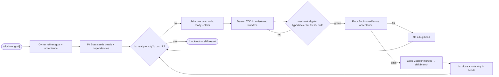

# The 5 to 9

**The shift that works while you're off the clock.**

[](https://github.com/jakecastillo/the-5-to-9/actions/workflows/validate.yml)
[](LICENSE)
[](CHANGELOG.md)
[](CONTRIBUTING.md)
[](https://github.com/jakecastillo/the-5-to-9/discussions)

> 🌙 **Hand it a goal before you log off. Read the shift report in the morning.**

The 5 to 9 is an autonomous **AI night-shift crew** for your repo. It clocks in a small team of role-agents — a developer, an independent QA inspector, a security reviewer, a merge gate — that work a [beads](https://github.com/steveyegge/beads) backlog in parallel and ralph-loop your code to done on a dedicated shift branch. Hands-off, test-gated, with hard stops only on irreversible actions. Funny on the surface, rigorous underneath.

**Two ways to run it** — as a Claude Code plugin (`/clock-in`), or as a standalone npm CLI that needs no Claude Code at all:

```bash
npx the-5-to-9 clock-in "ship the thing"      # or install globally: npm i -g the-5-to-9
```

Under the hood it's a deliberately portable core (`AGENTS.md` + skills + bash + beads + MCP) that also runs under Codex full-auto and other AGENTS.md-aware agents (native Codex/Cursor plugin wiring is [phase-2](#status)).

See **[docs/ARCHITECTURE.md](docs/ARCHITECTURE.md)** for the crew topology, the service loop, the safety gate, and the cross-tool design — with diagrams. For where the crew runs today (Claude CLI/App, Codex CLI/App) and what each surface gets, see **[docs/SURFACES.md](docs/SURFACES.md)**.

> Status: **v0.3.0, early/experimental.** Use with caution and keep an eye on long runs (see [Status](#status)).

---

## Why

More agents don't make better software. Role-theater — a dozen bots cosplaying a corp org chart, CC'ing each other into infinite meetings — burns tokens and ships nothing. The 5 to 9 bets on the opposite:

- **Crisp roles, not headcount.** A small crew, each with one job and a real boundary. No two agents own the same decision.
- **Beads memory, not a chat scrollback.** Work lives in a dependency-aware backlog (`bd`) with atomic claims and durable notes — not in a context window that rots over a long run.
- **Independent QA, not self-grading.** The cook who writes the code never signs off on it. A separate inspector verifies against the bead's acceptance criteria.
- **Hard gates, not vibes.** Reversible work just proceeds. Irreversible, outward-facing actions stop and ask. That's the whole safety model, and it's small on purpose.

If a step doesn't make the code more correct or the loop more honest, it's not in here.

---

## Meet the crew

| Name                   | Role                                           | Default model |
| ---------------------- | ---------------------------------------------- | ------------- |
| **The Owner**          | Executive — strategy & goal-setting            | `opus`        |
| **The Pit Boss**       | Project manager / orchestrator (lead)          | `sonnet`      |
| **The Cage Cashier**   | Integration / single-writer merge gate         | `sonnet`      |
| **The Dealer**         | Developer (TDD, works in an isolated worktree) | `sonnet`      |
| **The Floor Auditor**  | QA / independent verifier                      | `sonnet`      |
| **The Eye in the Sky** | Security                                       | `opus`        |
| **The Floorman**       | DevOps / CI-CD                                 | `haiku`       |

Right-sized models for right-sized jobs: the heavy thinkers (strategy, security) get `opus`, the steady workers get `sonnet`, the chores get `haiku`.

---

## How a shift works

1. **Clock in.** `/clock-in [goal]` — the crew shows up and reads the room.
2. **Stand-up.** The Owner refines the goal into real, testable outcomes. The Pit Boss turns those into beads with dependencies.
3. **The service loop** (repeat until the backlog is clear):
   - `bd ready --claim` — a fresh worker atomically claims the next unblocked bead.
   - The Dealer does **one** bead, TDD, in an isolated worktree.
   - **Mechanical gate** — the build/tests/lint run. No green, no pass.
   - **Independent QA** — the Floor Auditor verifies the work against the bead's acceptance criteria. The author doesn't grade their own homework.
   - **Close** the bead, record what happened in beads memory, and go back to `bd ready`.
4. **Clock out.** `/clock-out` ends the shift and prints a report: what shipped, what's blocked, what's next.
5. **Refine scope** and run the next shift.



Other commands: `/shift-status` (peek at the loop mid-run) and `/the-5-to-9` (help / overview).
The full set of diagrams — crew topology, the safety gate, and the cross-tool design — lives in
**[docs/ARCHITECTURE.md](docs/ARCHITECTURE.md)**.

Want to see it run? **[docs/sample-shift-report.md](docs/sample-shift-report.md)** is a captured
mechanics demo — setup through QUEUE-EMPTY through clock-out — driven by a scripted cook (not
an LLM) so it runs offline and is fully reproducible. Run `bash scripts/demo-shift.sh` to
regenerate it yourself.

---

## Ways to run

**1. Watched — `/clock-in`**
In-session, you're at the wheel. The loop **runs continuously by default** — it advances itself each turn until the backlog drains or a guard trips, no clock-out required. Context accumulates, so this is the one to babysit.

**2. Hands-off — `scripts/night-shift.sh`**
An external **fresh-process** loop — the real night-shift engine. Each iteration starts with clean context (no rot), works one bead, and exits. Point it at a long backlog before bed. Cap it with `--max-iterations N`, or omit to run until the backlog is empty or progress stalls.

```bash
bash scripts/night-shift.sh --max-iterations 25
```

**3. SDK driver — `scripts/clock-in-dispatch.sh --driver`**
A deterministic TypeScript runtime (K=1 on subscription backends like Claude/Codex; K≥2 needs `--backend api`). Requires Node ≥ 20 and `pnpm install` in `driver/`.

**4. Standalone CLI — `the-5-to-9` (no Claude Code required)**
A pure-Node CLI you can install from npm and run anywhere. It drives the same shift state, the same beads backlog, and the same irreversible-action gate as the plugin — just from your own terminal. Requires Node ≥ 20.19.

```bash
# one-off
npx the-5-to-9 status

# or install globally
npm i -g the-5-to-9
the-5-to-9 clock-in "ship the thing"
```

| Subcommand | What it does |
| --- | --- |
| `clock-in [goal...]` | Open a shift: write state and switch to a dedicated `the-5-to-9/shift-<date>` branch (`--no-branch` to skip). |
| `clock-out` | Close the shift, archive state, print the run summary. |
| `status` | Print the current shift state + backlog counts (read-only). |
| `dashboard` | One-shot dashboard view; `--watch` launches the live interactive Ink TUI (also the bare `the-5-to-9` default). |
| `run` | Start a detached driver run (`--backend`, `--max-iterations`, `-K`). |
| `config get\|set` | Read/write CLI config (`backend`, `maxIterations`) under `~/.config/the-5-to-9/`. |
| `doctor` | Preflight: Node version, `bd`, and the selected backend CLI. |

Same crew, same gates, same beads backlog every way — the difference is how long you leave it alone and which runtime drives.

**Watch any run** read-only with `/shift-status`, or the live TUI dashboard:

```bash
bash scripts/shift-dashboard.sh --watch
```

---

## Safety

The 5 to 9 is built to run under Claude Code **bypass-permissions** — so the gate and a real security policy aren't decoration, they're the point.

- **Autonomous on everything reversible.** Edits, commits, branches, PRs, and normal pushes to the shift branch just happen.
- **Hard-gated on irreversible, outward actions** — these stop and ask, every time:
  - Deploying to **prod / remote**.
  - **Publishing** a release or a package.
  - `git push --force`.
  - **Deleting remote data** — branches, prod DB, releases.
  - **Destroying or rotating secrets.**
- **Dedicated shift branch.** The crew works on its own branch; `main` / prod are never touched without the gate.
- **No-clobber.** It never edits your repo's `CLAUDE.md` / `AGENTS.md`. Context is injected additively via hooks and skills. Instruction priority is: **your repo > The 5 to 9 > defaults.**

---

## Install

Fresh machine? **[docs/INSTALL.md](docs/INSTALL.md)** is the full setup guide —
prerequisites, the three install options, the reload step, and the automatic beads
bootstrap on first clock-in. The short version:

**Local dev (edits reflect live):**

```bash
git clone https://github.com/jakecastillo/the-5-to-9
cd the-5-to-9
claude --plugin-dir "$PWD"
```

**Via marketplace (then reload):**

```text
/plugin marketplace add jakecastillo/the-5-to-9   # fetches the pushed main branch
/plugin install the-5-to-9@the-5-to-9
/reload-plugins                                   # installed plugins don't hot-load
```

Confirm with `claude plugin list` (`the-5-to-9@the-5-to-9 … ✔ enabled`) or by typing
`/` and seeing `/clock-in`.

Memory is beads: commit the JSONL export, and let the local `.beads` DB stay gitignored.
On first clock-in the crew auto-runs `bd init` + `bd import` from the committed export, so
`bd ready` works with no manual beads setup.

**Test gate:**

```bash
bash tests/validate-plugin.sh   # must exit 0; CI runs it
```

---

## Status

**v0.3.0 — early and experimental.** It works, but treat it like a new hire on the night shift: capable, worth watching. Use with caution, and **monitor long runs** — the fresh-process loop avoids context rot, but you still want eyes on it before you trust it with a big backlog unattended.

The **markdown plugin crew is the primary runtime.** There's also an experimental,
secondary **TypeScript driver under [`driver/`](driver/)** — a thin deterministic
orchestrator that shells out to `claude -p` / `codex exec` worker-adapters (Node ≥ 20, run
via `tsx`, no build step). It's optional and still maturing; reach for it only if you want
code-guaranteed dispatch instead of the in-session loop. See [docs/INSTALL.md](docs/INSTALL.md)
for setup.

It's built to play nicely with [superpowers](https://github.com/obra/superpowers) (agentic skills) and the Ralph loop technique, and it's being built to be **cross-tool** — Claude CLI today, with Codex CLI and apps to follow.

---

## Credits

The 5 to 9 complements these — it does not replace them:

- **[beads](https://github.com/steveyegge/beads)** — the `bd` issue tracker / agent memory, by Steve Yegge.
- **[superpowers](https://github.com/obra/superpowers)** — the agentic skills framework, by Jesse Vincent (github [obra](https://github.com/obra)).
- **The "Ralph" loop** technique, by Geoffrey Huntley.

---

## License

MIT — © jakecastillo.
