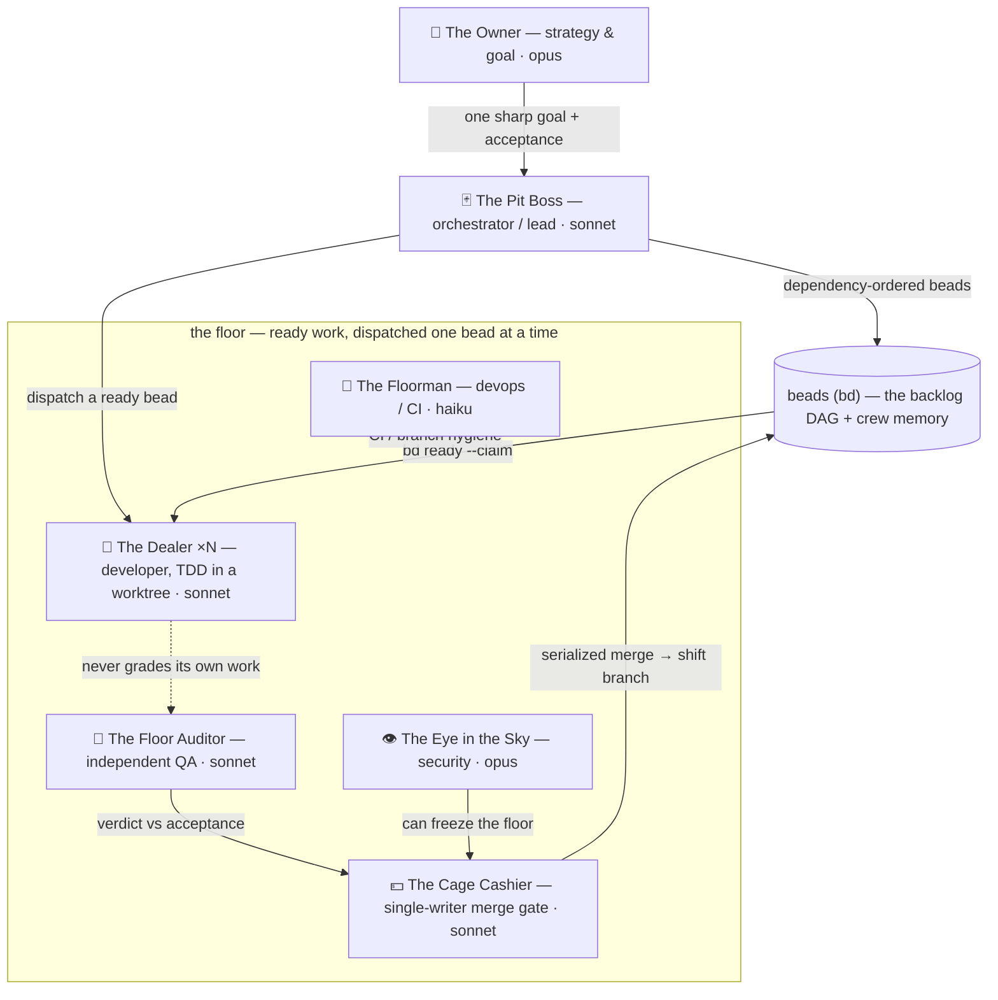
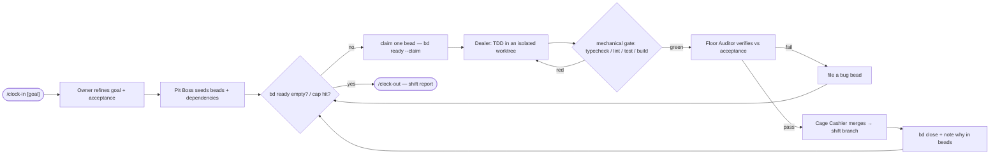
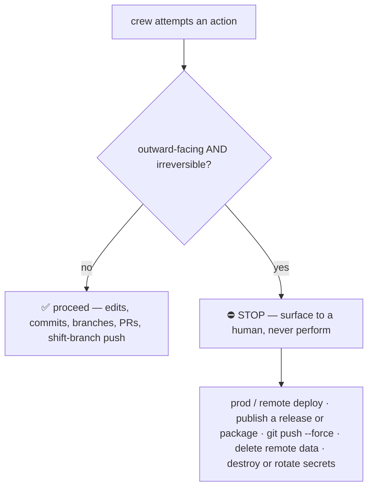
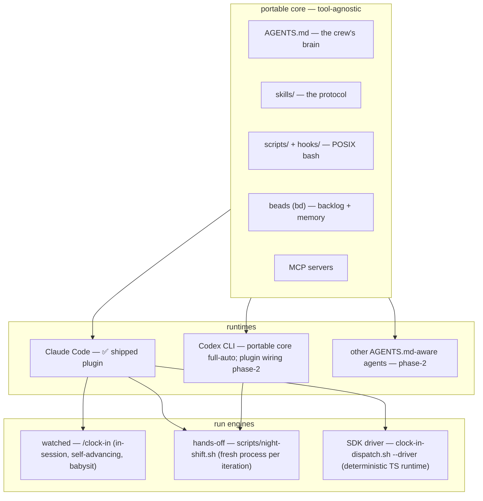

# Architecture — The 5 to 9

How the night-shift crew is wired: who's on the floor, how a shift loops, what the
safety gate stops, and why the core runs across more than one agent runtime. Diagrams
are [Mermaid](https://mermaid.js.org) and render natively on GitHub.

> One-line architecture: a small crew of role-agents works a [beads](https://github.com/steveyegge/beads)
> backlog on a dedicated shift branch — **read-parallel, write-serial**, author ≠ grader,
> capped iterations, hard gates only on irreversible outward actions.

---

## The crew (topology + the author ≠ grader firewall)

Crisp roles, not headcount. No two agents own the same decision, and **the one who
writes the code never signs it off** — a separate auditor verifies against the bead's
acceptance criteria.

| Role               | Job                                                               | Model    |
| ------------------ | ----------------------------------------------------------------- | -------- |
| The Owner          | strategy & goal-setting; signs off irreversible actions           | `opus`   |
| The Pit Boss       | orchestrator / lead — turns the goal into a beads DAG, dispatches | `sonnet` |
| The Cage Cashier   | integration — the single-writer merge gate                        | `sonnet` |
| The Dealer         | developer — one bead, TDD, isolated worktree (several at once)    | `sonnet` |
| The Floor Auditor  | independent QA — re-counts work against acceptance                | `sonnet` |
| The Eye in the Sky | security — scans changes, can freeze a release                    | `opus`   |
| The Floorman       | devops / CI-CD — config, lint, hygiene, staging                   | `haiku`  |

---

## The service loop (one shift)

`/clock-in` once; the loop self-advances until the backlog drains, progress stalls, or an
optional iteration cap is hit. **Reads fan out in parallel; writes serialize** through the Cage.

Two guards keep the loop honest: a **no-progress stall** check (stop if the closed-bead
count doesn't move for N iterations) and **QUEUE-EMPTY** (stop when `bd ready` drains).
The loop is **uncapped by default** — it advances itself and runs to empty or stall, no
clock-out required — while an explicit **iteration cap** (`--max-iterations N`) stays
available when you want a hard ceiling. Long hands-off runs use a **fresh process per
iteration** so context never rots (see [run engines](#cross-tool-portability--run-engines)).

---

## The irreversible-action gate

The whole safety model, small on purpose. Everything reversible just proceeds; only
**outward-facing, irreversible** actions stop and surface for a human. The gate runs on
Node and **fails closed to a bash classifier** if Node is absent — it never silent-allows.

The crew works a **dedicated shift branch**; `main` / prod are never touched without the
gate. It also **never** edits your repo's `CLAUDE.md` / `AGENTS.md` — context is additive,
and instruction priority is **your repo > The 5 to 9 > defaults**.

---

## Cross-tool portability + run engines

The 5 to 9 ships as a Claude Code plugin, but over a deliberately **portable core**. The
brain (`AGENTS.md`), the protocol (`skills/`), the loop (`scripts/` + `hooks/`, POSIX
bash), the memory (`beads`), and MCP servers are tool-agnostic. What's Claude-specific is
the _wiring_ — packaged slash commands, subagent fan-out, manifest-driven hooks — which is
phase-2 for other runtimes.

Three ways to drive the same crew, gates, and beads backlog:

- **Watched** (`/clock-in`) runs in-session and **advances itself** until the backlog
  drains or a guard trips — best for shifts you babysit, since context accumulates.
- **Hands-off** (`scripts/night-shift.sh`) is the real night-shift engine: each iteration
  starts a fresh agent process with clean context, works one bead, and exits — no context
  rot over a long backlog. `--max-iterations N` caps it; omit to run to empty/stall.
- **SDK driver** (`scripts/clock-in-dispatch.sh --driver`) is a deterministic TypeScript
  runtime (K=1 on subscription backends; K≥2 needs `--backend api`). The dispatch script
  is the only junction — the bash loop and the driver never share code.

Watch any run read-only with `/shift-status` or the live TUI:
`bash scripts/shift-dashboard.sh --watch`.

---

See also: [`README.md`](../README.md) (overview), [`docs/INSTALL.md`](INSTALL.md)
(setup), [`docs/SURFACES.md`](SURFACES.md) (per-surface support matrix), the
`running-the-shift` skill (the protocol in full), and design notes under
[`docs/superpowers/`](superpowers/).
